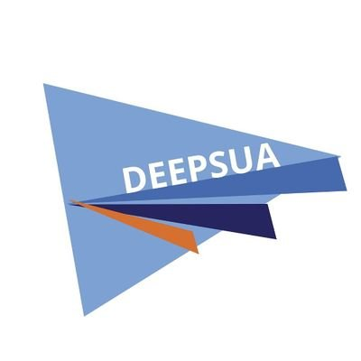

# Repositori de la Delegació d'Estudiants de l'Escola Politècnica Superior de la Universitat d'Alacant

  

Benvinguts i benvingudes al repositori oficial de DEEPSUA. Ací podeu trobar les ferramentes desenvolupades pel grup de treball d'Infraestructures, a més de les ferramentes d'organització de la Delegació.

Accedeix a la pestanya *Projects* per veure els projectes actius!

<!--

**Here are some ideas to get you started:**

🙋‍♀️ A short introduction - what is your organization all about?
🌈 Contribution guidelines - how can the community get involved?
👩‍💻 Useful resources - where can the community find your docs? Is there anything else the community should know?
🍿 Fun facts - what does your team eat for breakfast?
🧙 Remember, you can do mighty things with the power of [Markdown](https://docs.github.com/github/writing-on-github/getting-started-with-writing-and-formatting-on-github/basic-writing-and-formatting-syntax)
-->
